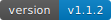

# I found a better option - playwright - and Microsoft has a MCP of it already. Please check out https://github.com/microsoft/playwright-mcp if you're trying this sort of thing.

[](https://www.npmjs.com/package/puppeteer-mcp)
[](https://www.npmjs.com/package/puppeteer-mcp)
[](LICENSE)
[](https://www.typescriptlang.org/)
[](https://nodejs.org/)



**Beta release of AI-enabled browser automation platform** with REST, gRPC, WebSocket, and Model
Context Protocol (MCP) interfaces, unified session management, and enterprise-focused security.

> **🔔 We Need Your Feedback!** This project is in beta and we're actively seeking user feedback to
> ensure it meets production requirements. Please
> [report issues](https://github.com/williamzujkowski/puppeteer-mcp/issues) or share your
> experience.

## 📚 Documentation

**Full documentation is available at:
[https://williamzujkowski.github.io/puppeteer-mcp/](https://williamzujkowski.github.io/puppeteer-mcp/)**

- [Quick Start Guide](https://williamzujkowski.github.io/puppeteer-mcp/quickstart/)
- [API Reference](https://williamzujkowski.github.io/puppeteer-mcp/api/)
- [Architecture Overview](https://williamzujkowski.github.io/puppeteer-mcp/architecture/)
- [Development Guide](https://williamzujkowski.github.io/puppeteer-mcp/development/)

## 🚀 Quick Start

### Install from npm

```bash
# Install globally
npm install -g puppeteer-mcp

# Start MCP server
puppeteer-mcp

# Or use with npx (no installation required)
npx puppeteer-mcp
```

### Configure for Claude Desktop

Add to your Claude Desktop configuration:

```json
{
  "mcpServers": {
    "puppeteer-mcp": {
      "command": "puppeteer-mcp",
      "args": [],
      "env": {
        "MCP_TRANSPORT": "stdio"
      }
    }
  }
}
```

**Configuration file locations:**

- macOS: `~/Library/Application Support/Claude/claude_desktop_config.json`
- Windows: `%APPDATA%\Claude\claude_desktop_config.json`
- Linux: `~/.config/claude/claude_desktop_config.json`

### Configure Telemetry (Optional)

Puppeteer MCP includes OpenTelemetry instrumentation for observability:

```bash
# Basic telemetry configuration
export TELEMETRY_ENABLED=true
export TELEMETRY_TRACE_EXPORTER=otlp
export TELEMETRY_TRACE_OTLP_ENDPOINT=http://localhost:4318/v1/traces

# Start with telemetry
puppeteer-mcp
```

See the [Telemetry Documentation](starlight-docs/src/content/docs/operations/telemetry.md) for detailed configuration options.

## 🎯 Key Features

- **🤖 AI-Ready**: Native MCP support for LLM browser control
- **🌐 Multi-Protocol**: REST, gRPC, WebSocket, and MCP interfaces
- **🔒 Enterprise Security**: NIST-compliant with zero-trust architecture
- **🎭 Full Puppeteer Integration**: 13+ browser action types
- **📊 Production Grade**: Resource pooling, health monitoring, metrics
- **🚀 High Performance**: Sub-100ms API response times
- **📡 OpenTelemetry**: Distributed tracing, metrics, and observability

## 📋 Prerequisites

- Node.js 20+ and npm
- Chrome/Chromium (automatically downloaded by Puppeteer if not present)

## 🛠️ Development

```bash
# Clone the repository
git clone https://github.com/williamzujkowski/puppeteer-mcp.git
cd puppeteer-mcp

# Install dependencies
npm install

# Build the project
npm run build

# Run tests
npm test

# Start development server
npm run dev
```

## 🤝 Contributing

We welcome contributions! Please see our [Contributing Guide](CONTRIBUTING.md) for details.

## 📄 License

This project is licensed under the MIT License - see the [LICENSE](LICENSE) file for details.

## 🔗 Links

- [NPM Package](https://www.npmjs.com/package/puppeteer-mcp)
- [GitHub Repository](https://github.com/williamzujkowski/puppeteer-mcp)
- [Documentation](https://williamzujkowski.github.io/puppeteer-mcp/)
- [Issue Tracker](https://github.com/williamzujkowski/puppeteer-mcp/issues)
