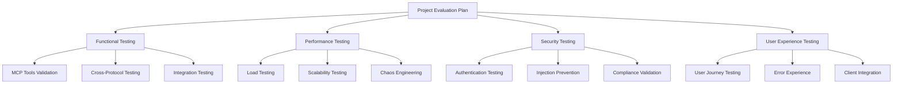

# 🎯 Comprehensive Project Evaluation Plan

## Puppeteer-MCP: Browser Automation via Model Context Protocol

**Version**: 1.0  
**Status**: Active  
**Evaluation Period**: Q1-Q2 2025  
**Last Updated**: January 11, 2025

---

## 📋 Executive Summary

This comprehensive evaluation plan validates that the **puppeteer-mcp** project delivers reliable
browser automation capabilities through the Model Context Protocol (MCP), meeting enterprise
production requirements and exceeding user expectations.

### **Project Scope**

- **8 MCP Tools**: Complete browser automation toolkit
- **4 Protocol Interfaces**: MCP, REST, gRPC, WebSocket
- **Multi-User Support**: Concurrent sessions with isolation
- **Enterprise Security**: NIST compliance, authentication, data protection
- **Production Scale**: 1000+ concurrent sessions, 500+ actions/second

### **Evaluation Objectives**

1. **Functional Validation**: Every MCP tool and protocol interface works flawlessly
2. **Performance Verification**: Meets enterprise scalability and responsiveness requirements
3. **Security Assurance**: Production-grade security with zero critical vulnerabilities
4. **User Experience Excellence**: Intuitive, efficient workflows with exceptional error handling
5. **Production Readiness**: Complete operational readiness for enterprise deployment

---

## 🏗️ Evaluation Framework Architecture

### **Four-Pillar Testing Strategy**

### **Evaluation Methodology**

| Phase                    | Duration    | Focus                         | Success Criteria                           |
| ------------------------ | ----------- | ----------------------------- | ------------------------------------------ |
| **Foundation**           | Weeks 1-2   | Infrastructure & Tooling      | Testing frameworks operational             |
| **Core Validation**      | Weeks 3-6   | Functional & Performance      | All tools working, performance targets met |
| **Security Hardening**   | Weeks 7-10  | Security & Compliance         | Zero critical vulnerabilities              |
| **User Experience**      | Weeks 11-14 | UX & Integration              | >90% task completion rate                  |
| **Production Readiness** | Weeks 15-16 | Final validation & deployment | Production deployment approved             |

---

## 🔧 Detailed Testing Strategies

### **1. Functional Testing Strategy**

**Objective**: Validate every MCP tool and protocol interface works correctly

#### **MCP Tools Testing Matrix**

| Tool                     | Valid Inputs                    | Invalid Inputs             | Edge Cases              | Cross-Protocol             |
| ------------------------ | ------------------------------- | -------------------------- | ----------------------- | -------------------------- |
| `create-session`         | ✅ Username/password validation | ❌ Invalid credentials     | 🔄 Concurrent creation  | 🌐 REST/gRPC/WS equivalent |
| `list-sessions`          | ✅ User filtering               | ❌ Invalid user IDs        | 📊 Large session counts | 🌐 Protocol consistency    |
| `delete-session`         | ✅ Valid session IDs            | ❌ Non-existent sessions   | 🗑️ Already deleted      | 🌐 Cross-protocol sync     |
| `create-browser-context` | ✅ Valid configurations         | ❌ Invalid browser options | 🖥️ Resource limits      | 🌐 Protocol parity         |
| `list-browser-contexts`  | ✅ Session filtering            | ❌ Invalid sessions        | 📈 Scale testing        | 🌐 Consistent responses    |
| `close-browser-context`  | ✅ Valid context IDs            | ❌ Non-existent contexts   | 🔄 Cleanup validation   | 🌐 State synchronization   |
| `execute-in-context`     | ✅ All command types            | ❌ Invalid parameters      | ⚡ Complex workflows    | 🌐 Performance comparison  |
| `execute-api`            | ✅ Protocol operations          | ❌ Invalid protocols       | 🔗 Chained operations   | 🌐 Native vs MCP           |

#### **Browser Automation Command Testing**

| Category        | Commands                              | Test Coverage                                         |
| --------------- | ------------------------------------- | ----------------------------------------------------- |
| **Navigation**  | navigate, goBack, goForward, reload   | URL validation, history management, timeout handling  |
| **Interaction** | click, type, select, upload, hover    | Element selection, timing, file validation            |
| **Content**     | evaluate, screenshot, pdf, content    | Security validation, format verification, size limits |
| **Utility**     | wait, scroll, keyboard, mouse, cookie | Condition handling, positioning, data persistence     |

#### **Resource Testing**

- **`api://catalog`**: Complete API documentation validation
- **`api://health`**: Real-time system status verification

### **2. Performance Testing Strategy**

**Objective**: Validate enterprise-scale performance and scalability

#### **Load Testing Scenarios**

| Scenario        | Load Profile              | Target Metrics       | Duration   |
| --------------- | ------------------------- | -------------------- | ---------- |
| **Normal Load** | 100 concurrent sessions   | <500ms response time | 1 hour     |
| **Peak Load**   | 1000 concurrent sessions  | <1s response time    | 30 minutes |
| **Stress Test** | 2000+ concurrent sessions | Graceful degradation | 15 minutes |
| **Endurance**   | 500 concurrent sessions   | No memory leaks      | 24 hours   |

#### **Performance Targets**

- **Session Creation**: <500ms (P95)
- **Browser Acquisition**: <2s (P95)
- **Action Execution**: <100ms (P95)
- **Screenshot Generation**: <500ms (P95)
- **Concurrent Sessions**: 1000 (2000 peak)
- **Actions per Second**: 500 (1000 peak)

#### **Chaos Engineering**

- Network failures and partitions
- Browser crashes and recovery
- Resource exhaustion scenarios
- Service restart testing

### **3. Security Testing Strategy**

**Objective**: Ensure production-grade security with zero vulnerabilities

#### **Security Testing Areas**

| Area                 | Test Types                                             | Coverage                  |
| -------------------- | ------------------------------------------------------ | ------------------------- |
| **Authentication**   | JWT validation, API key security, session hijacking    | 100% auth endpoints       |
| **Input Validation** | XSS, SQL injection, command injection                  | All input parameters      |
| **Network Security** | TLS validation, certificate management, DoS protection | All protocols             |
| **Data Protection**  | Session isolation, PII handling, encryption            | All data flows            |
| **Browser Security** | Sandbox escape, malicious sites, download security     | All browser operations    |
| **Compliance**       | NIST controls, audit logging, incident response        | All security requirements |

#### **Security Targets**

- **Vulnerabilities**: Zero critical, zero high
- **Authentication**: 100% endpoint coverage
- **Encryption**: All data in transit and at rest
- **Audit**: Complete security event logging
- **Compliance**: 100% NIST control implementation

### **4. User Experience Testing Strategy**

**Objective**: Deliver exceptional user experience across all interfaces

#### **User Personas & Scenarios**

| Persona                           | Primary Use Case            | Success Criteria             |
| --------------------------------- | --------------------------- | ---------------------------- |
| **Alex** (Web Scraping Developer) | Data extraction workflows   | <30min time to first success |
| **Sarah** (QA Engineer)           | Automated testing scenarios | >95% test reliability        |
| **Mike** (Business Analyst)       | Report automation           | Natural language interface   |
| **Emma** (DevOps Engineer)        | Monitoring & alerting       | <5min setup time             |
| **David** (AI Developer)          | MCP client integration      | Seamless Claude integration  |

#### **Client Integration Testing**

- **Claude Desktop**: Natural language automation
- **VS Code Extensions**: Cline/Continue compatibility
- **Custom Clients**: Protocol compliance testing
- **API Documentation**: Developer experience validation

---

## 📊 Success Criteria & Evaluation Metrics

### **Functional Excellence**

- ✅ **100% Test Coverage**: All MCP tools and protocols
- ✅ **Zero Critical Bugs**: No blocking issues
- ✅ **Cross-Protocol Parity**: Consistent behavior across interfaces
- ✅ **Error Handling**: Graceful failure recovery

### **Performance Excellence**

- 🚀 **Response Times**: Meet all P95 targets
- 📈 **Scalability**: Handle 1000+ concurrent sessions
- 💪 **Reliability**: 99.9% uptime under load
- 🔄 **Recovery**: <5min mean time to recovery

### **Security Excellence**

- 🔒 **Zero Vulnerabilities**: No critical or high severity issues
- 🛡️ **Authentication**: 100% endpoint protection
- 📋 **Compliance**: Complete NIST control implementation
- 🔍 **Monitoring**: Real-time security event detection

### **User Experience Excellence**

- 😊 **User Satisfaction**: >4.5/5 rating
- ⚡ **Time to Success**: <30min for new users
- 🎯 **Task Completion**: >90% success rate
- 🆘 **Error Experience**: Clear, actionable error messages

---

## 🗓️ Implementation Timeline

### **Phase 1: Foundation (Weeks 1-2)**

- [ ] Set up testing infrastructure
- [ ] Configure CI/CD pipelines
- [ ] Initialize monitoring systems
- [ ] Establish baseline metrics

### **Phase 2: Core Validation (Weeks 3-6)**

- [ ] Execute functional test suite
- [ ] Perform load and stress testing
- [ ] Validate cross-protocol consistency
- [ ] Benchmark performance metrics

### **Phase 3: Security Hardening (Weeks 7-10)**

- [ ] Complete security penetration testing
- [ ] Validate authentication mechanisms
- [ ] Verify compliance controls
- [ ] Implement security monitoring

### **Phase 4: User Experience (Weeks 11-14)**

- [ ] Conduct user journey testing
- [ ] Validate client integrations
- [ ] Test error handling workflows
- [ ] Optimize user interfaces

### **Phase 5: Production Readiness (Weeks 15-16)**

- [ ] Final validation testing
- [ ] Performance optimization
- [ ] Security certification
- [ ] Deployment approval

---

## 🛠️ Implementation Strategy

### **Resource Allocation**

| Role                      | Allocation | Responsibilities                              |
| ------------------------- | ---------- | --------------------------------------------- |
| **Test Lead**             | 100%       | Overall coordination, strategy execution      |
| **Functional Testers**    | 2 FTE      | MCP tools, protocols, integration testing     |
| **Performance Engineers** | 1 FTE      | Load testing, chaos engineering, optimization |
| **Security Specialists**  | 1 FTE      | Penetration testing, compliance validation    |
| **UX Researchers**        | 0.5 FTE    | User journey testing, client integration      |
| **DevOps Engineers**      | 0.5 FTE    | Infrastructure, CI/CD, monitoring             |

### **Technology Stack**

- **Functional Testing**: Jest, TypeScript, Custom MCP clients
- **Performance Testing**: K6, Artillery, Custom load generators
- **Security Testing**: OWASP ZAP, Burp Suite, Static analysis tools
- **Monitoring**: Prometheus, Grafana, Custom dashboards
- **CI/CD**: GitHub Actions, Docker, Kubernetes

### **Infrastructure Requirements**

- **Test Environment**: Kubernetes cluster with auto-scaling
- **Load Generation**: Distributed test runners across regions
- **Monitoring**: Real-time metrics collection and alerting
- **Security**: Isolated test environments with network segmentation

---

## 📈 Monitoring & Reporting

### **Real-Time Dashboards**

1. **Functional Test Status**: Pass/fail rates, coverage metrics
2. **Performance Metrics**: Response times, throughput, resource usage
3. **Security Status**: Vulnerability counts, compliance scores
4. **User Experience**: Task completion rates, error frequencies

### **Weekly Reporting**

- **Executive Summary**: High-level status and key metrics
- **Detailed Results**: Test execution details and findings
- **Risk Assessment**: Identified issues and mitigation plans
- **Progress Tracking**: Timeline adherence and milestone completion

### **Milestone Deliverables**

| Milestone                     | Deliverable                        | Acceptance Criteria                        |
| ----------------------------- | ---------------------------------- | ------------------------------------------ |
| **Foundation Complete**       | Testing infrastructure operational | All tools configured and validated         |
| **Functional Validation**     | Comprehensive test results         | 100% test coverage, zero critical issues   |
| **Performance Certification** | Performance test report            | All targets met, scalability validated     |
| **Security Clearance**        | Security assessment report         | Zero vulnerabilities, compliance certified |
| **UX Validation**             | User experience report             | >90% task completion, >4.5/5 satisfaction  |
| **Production Ready**          | Final evaluation report            | All criteria met, deployment approved      |

---

## 🎯 Success Evaluation Framework

### **Go/No-Go Criteria**

| Category            | Criteria                      | Weight | Target |
| ------------------- | ----------------------------- | ------ | ------ |
| **Functional**      | All tests passing             | 25%    | 100%   |
| **Performance**     | Targets achieved              | 25%    | 100%   |
| **Security**        | Zero critical vulnerabilities | 25%    | 100%   |
| **User Experience** | >90% task completion          | 25%    | 100%   |

### **Quality Gates**

- **Gate 1**: Functional testing complete with <5 critical issues
- **Gate 2**: Performance targets met with <10% degradation
- **Gate 3**: Security cleared with zero high/critical vulnerabilities
- **Gate 4**: UX validated with >85% user satisfaction
- **Gate 5**: Production readiness with all criteria met

### **Risk Mitigation**

| Risk                         | Impact | Probability | Mitigation Strategy                             |
| ---------------------------- | ------ | ----------- | ----------------------------------------------- |
| **Performance Degradation**  | High   | Medium      | Early performance testing, optimization sprints |
| **Security Vulnerabilities** | High   | Low         | Continuous security scanning, expert review     |
| **Integration Issues**       | Medium | Medium      | Early client testing, protocol validation       |
| **Resource Constraints**     | Medium | Low         | Flexible team allocation, vendor support        |

---

## 🔄 Continuous Improvement

### **Post-Evaluation Actions**

1. **Performance Optimization**: Address any performance gaps
2. **Security Hardening**: Implement additional security measures
3. **UX Enhancement**: Improve user experience based on feedback
4. **Documentation Updates**: Ensure comprehensive user documentation

### **Ongoing Validation**

- **Weekly**: Automated test suite execution
- **Monthly**: Performance regression testing
- **Quarterly**: Security penetration testing
- **Annually**: Comprehensive evaluation refresh

### **Feedback Integration**

- **User Feedback**: Continuous collection and analysis
- **Performance Monitoring**: Real-time production metrics
- **Security Monitoring**: Continuous threat detection
- **Feature Requests**: Prioritized backlog management

---

## 📞 Contact Information

| Role                | Name | Email | Responsibilities                   |
| ------------------- | ---- | ----- | ---------------------------------- |
| **Evaluation Lead** | TBD  | TBD   | Overall evaluation coordination    |
| **Technical Lead**  | TBD  | TBD   | Technical implementation oversight |
| **Product Owner**   | TBD  | TBD   | Requirements and acceptance        |
| **Security Lead**   | TBD  | TBD   | Security validation and compliance |

---

## 📚 Related Documentation

- [Functional Testing Strategy](./FUNCTIONAL_TESTING_STRATEGY.md)
- [Performance Testing Strategy](./performance-testing-strategy.md)
- [Security Testing Strategy](./SECURITY_TESTING_STRATEGY.md)
- [UX Testing Strategy](./ux-testing-strategy.md)
- [Implementation Guidelines](../tests/README.md)
- [Project Architecture](./ARCHITECTURE.md)

---

**This comprehensive evaluation plan ensures the puppeteer-mcp project delivers exceptional browser
automation capabilities through the Model Context Protocol, meeting enterprise requirements and
exceeding user expectations.**

---

_Generated with advanced AI planning techniques | Last updated: January 11, 2025_
