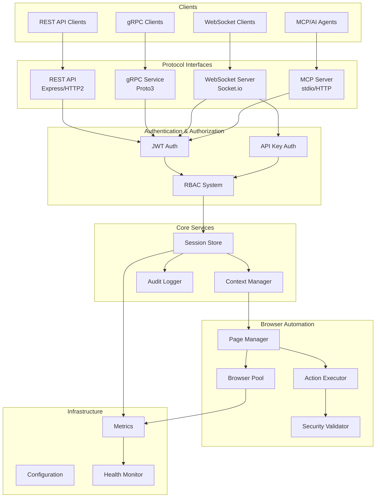
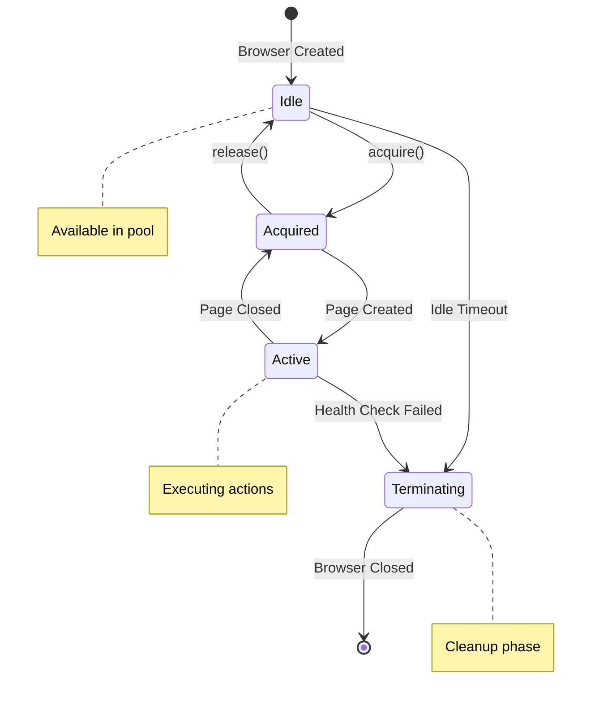
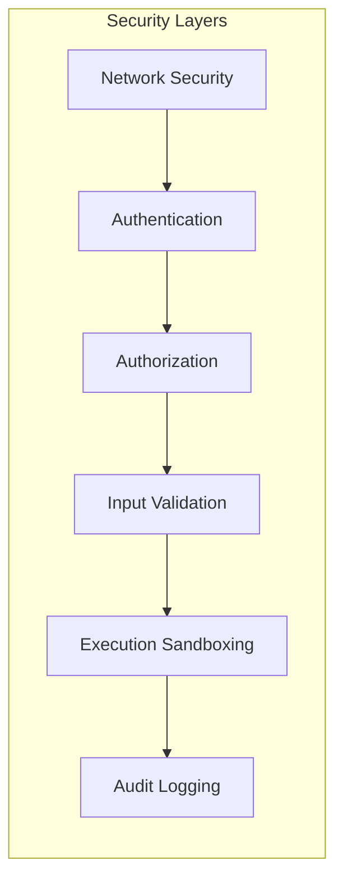
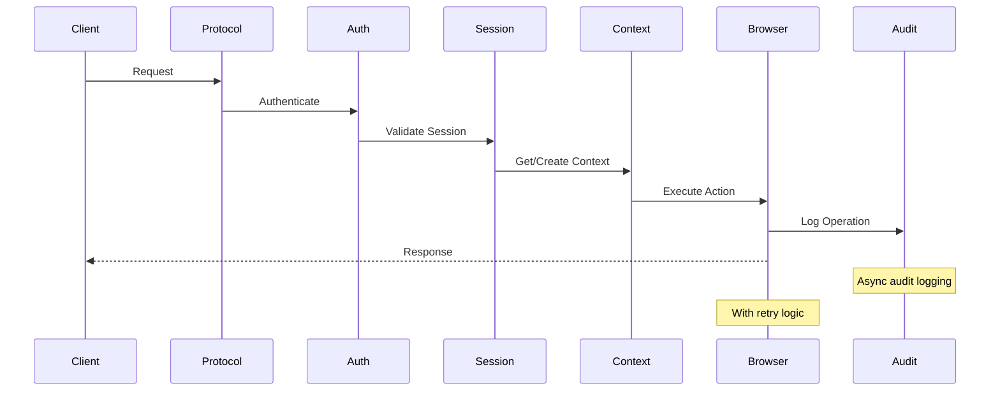

# Architecture Overview

## System Architecture

The Puppeteer MCP platform is a beta, AI-enabled browser automation system that provides unified
access through multiple protocol interfaces. The architecture follows a layered approach with strong
separation of concerns, enterprise-focused security, and comprehensive resource management.



## Core Components

### 1. Protocol Interfaces

The platform provides four distinct protocol interfaces, each optimized for specific use cases:

#### REST API (`/src/routes/`)

- **Technology**: Express.js with HTTP/2 support
- **Features**:
  - RESTful design with versioned endpoints (`/api/v1`)
  - OpenAPI 3.0 specification ready
  - Comprehensive error handling with structured responses
  - Request validation using Zod schemas
- **Use Cases**: Traditional web applications, mobile apps, simple integrations

#### gRPC Service (`/src/grpc/`)

- **Technology**: Protocol Buffers v3 with TypeScript stubs
- **Features**:
  - High-performance binary protocol
  - Bidirectional streaming support
  - Type-safe service definitions
  - Interceptor chain for cross-cutting concerns
- **Use Cases**: Microservices, high-throughput systems, real-time data

#### WebSocket Server (`/src/ws/`)

- **Technology**: Socket.io with custom message envelope
- **Features**:
  - Real-time bidirectional communication
  - Topic-based subscriptions
  - Event broadcasting
  - Heartbeat mechanism for connection health
- **Use Cases**: Real-time notifications, live browser events, collaborative features

#### MCP Server (`/src/mcp/`)

- **Technology**: Model Context Protocol with TypeScript SDK
- **Features**:
  - AI agent integration
  - Tool-based interface for LLMs
  - Resource exposure for discovery
  - Protocol adapters for unified access
- **Use Cases**: AI-driven automation, LLM integration, intelligent testing

### 2. Authentication & Authorization

#### Multi-Modal Authentication

The platform supports two authentication modes that can be used independently or together:

```typescript
// JWT Authentication Flow
interface JWTAuth {
  accessToken: string; // Short-lived (15m)
  refreshToken: string; // Long-lived (7d)
  permissions: string[]; // RBAC permissions
}

// API Key Authentication
interface APIKeyAuth {
  key: string; // Long-lived key
  scopes: string[]; // Allowed operations
  rateLimit: number; // Requests per minute
}
```

#### RBAC System

- **20+ granular permissions** covering all operations
- **Role composition** for flexible access control
- **Session-based enforcement** across all protocols
- **NIST compliance** with tagged security controls

### 3. Session Management

The session store provides unified state management across all protocols:

```typescript
interface Session {
  id: string;
  userId: string;
  permissions: string[];
  contexts: Map<string, Context>;
  metadata: SessionMetadata;
  auditLog: AuditEntry[];
}
```

#### Key Features:

- **In-memory storage** with Redis-ready interface
- **Context isolation** per session
- **Automatic cleanup** on expiration
- **Comprehensive audit logging** for compliance
- **Cross-protocol sharing** of session state

### 4. Browser Pool Architecture

The browser pool manages Puppeteer instances efficiently:



#### Resource Management:

- **Configurable pool size** (default: 5 browsers)
- **Health monitoring** with automatic recovery
- **Idle timeout** (default: 300s)
- **Queue management** for acquisition requests
- **Graceful shutdown** with proper cleanup

### 5. Page Manager

Manages browser pages within contexts:

```typescript
interface PageInfo {
  pageId: string;
  contextId: string;
  sessionId: string;
  url: string;
  viewport: Viewport;
  created: Date;
  lastActivity: Date;
}
```

#### Lifecycle Management:

1. **Creation**: Context creates page with session binding
2. **Operation**: Actions executed with security validation
3. **Events**: Real-time events emitted via WebSocket
4. **Cleanup**: Automatic cleanup on context deletion

### 6. Action Executor

Executes browser automation commands with comprehensive validation:

#### Supported Actions:

- **Navigation**: navigate, goBack, goForward, reload
- **Interaction**: click, type, select, upload, hover, focus, blur
- **Content**: evaluate, screenshot, pdf, content
- **Utility**: wait, scroll, keyboard, mouse, cookies

#### Security Framework:

```typescript
// Action validation pipeline
async function executeAction(action: BrowserAction) {
  // 1. Input validation
  validateActionType(action);
  validateActionParams(action);

  // 2. Security checks
  validateJavaScript(action); // XSS prevention
  validateURL(action); // Protocol allowlist

  // 3. Authorization
  authorizeAction(sessionId, action);

  // 4. Execution with monitoring
  const result = await withMetrics(() => performAction(page, action));

  // 5. Audit logging
  auditLog(sessionId, action, result);

  return result;
}
```

## Security Architecture

### Defense in Depth

The platform implements multiple security layers:



#### 1. Network Security

- **TLS enforcement** for all external communication
- **Security headers** via Helmet.js
- **Rate limiting** per endpoint and client
- **CORS configuration** with strict origins

#### 2. Authentication Layer

- **JWT verification** with RSA signatures
- **Token rotation** for refresh tokens
- **API key validation** with bcrypt hashing
- **Session binding** to prevent hijacking

#### 3. Authorization Layer

- **RBAC enforcement** on all operations
- **Resource-based permissions** for fine-grained control
- **Context isolation** between sessions
- **Audit trail** for all authorization decisions

#### 4. Input Validation

- **Zod schemas** for all API inputs
- **XSS prevention** for JavaScript execution
- **URL validation** with protocol allowlisting
- **File upload restrictions** with type checking

#### 5. Execution Sandboxing

- **Browser sandbox** with restricted permissions
- **JavaScript execution** in isolated contexts
- **Network interception** for request filtering
- **Resource limits** on browser operations

#### 6. Audit Logging

- **Comprehensive event capture** for all operations
- **NIST AU-3 compliance** for audit records
- **Tamper-proof storage** with integrity checks
- **Retention policies** for compliance

### NIST Compliance

All security controls are tagged with NIST 800-53r5 references:

```typescript
/**
 * @nist ac-2 "Account management"
 * @nist ac-3 "Access enforcement"
 * @nist ac-6 "Least privilege"
 */
class AuthorizationService {
  // Implementation
}
```

## Data Flow Architecture

### Request Lifecycle



### Event Flow

Real-time events flow through the WebSocket layer:

```typescript
// Event emission pattern
interface BrowserEvent {
  type: 'page.created' | 'page.navigated' | 'action.completed';
  sessionId: string;
  contextId: string;
  timestamp: Date;
  data: any;
}

// Subscription model
socket.on('subscribe', ({ topics }) => {
  topics.forEach((topic) => {
    subscriptionManager.subscribe(socket.id, topic);
  });
});
```

## Performance Architecture

### Resource Optimization

1. **Connection Pooling**
   - Browser instance reuse
   - Database connection pooling
   - HTTP keep-alive connections

2. **Caching Strategy**
   - Session cache with TTL
   - Static resource caching
   - Browser cache management

3. **Async Processing**
   - Non-blocking I/O throughout
   - Event-driven architecture
   - Worker thread utilization

### Monitoring & Metrics

```typescript
interface SystemMetrics {
  // Resource metrics
  browserPool: {
    size: number;
    available: number;
    queued: number;
  };

  // Performance metrics
  latency: {
    p50: number;
    p95: number;
    p99: number;
  };

  // Health indicators
  health: {
    status: 'healthy' | 'degraded' | 'unhealthy';
    checks: HealthCheck[];
  };
}
```

## Deployment Architecture

### Container Structure

```dockerfile
# Multi-stage build
FROM node:20-slim AS builder
# Build stage with dev dependencies

FROM node:20-slim AS runtime
# Runtime with minimal footprint
# Non-root user execution
# Health check endpoints
```

### Scalability Considerations

1. **Horizontal Scaling**
   - Stateless design for easy scaling
   - Session affinity for WebSocket connections
   - Distributed browser pool support

2. **Vertical Scaling**
   - Configurable browser pool size
   - Adjustable memory limits
   - CPU throttling controls

## Integration Patterns

### Protocol Adapters

Each protocol adapter translates requests to a common internal format:

```typescript
// Common command interface
interface Command {
  action: string;
  params: Record<string, any>;
  context: ExecutionContext;
}

// Protocol-specific adapters
class RESTAdapter implements ProtocolAdapter {
  async adapt(req: Request): Promise<Command> {
    // REST to Command translation
  }
}
```

### Extension Points

The architecture provides several extension points:

1. **Custom Actions**: Register new browser actions
2. **Auth Providers**: Add authentication methods
3. **Event Handlers**: Subscribe to system events
4. **Middleware**: Add cross-cutting concerns
5. **Health Checks**: Define custom health indicators

## Summary

The Puppeteer MCP architecture delivers:

- **Multi-protocol access** with unified session management
- **Enterprise security** with comprehensive NIST compliance
- **Scalable browser automation** with resource pooling
- **Real-time capabilities** through event-driven design
- **AI integration** via Model Context Protocol
- **Beta release** with monitoring and health checks

This architecture serves as a reference implementation for building secure, scalable, and AI-ready
browser automation platforms.
