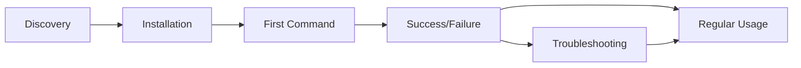

# Comprehensive UX Testing Strategy for Puppeteer-MCP

## Executive Summary

This document outlines a comprehensive User Experience (UX) testing strategy for the puppeteer-mcp
project, focusing on real-world usage scenarios, user journey validation, MCP client integration,
API usability, workflow complexity, and error handling from the user's perspective.

## Table of Contents

1. [User Personas](#user-personas)
2. [Real User Scenarios](#real-user-scenarios)
3. [User Journey Testing](#user-journey-testing)
4. [MCP Client Integration Testing](#mcp-client-integration-testing)
5. [API Usability Testing](#api-usability-testing)
6. [Workflow Complexity Testing](#workflow-complexity-testing)
7. [Error Experience Testing](#error-experience-testing)
8. [Implementation Strategy](#implementation-strategy)
9. [Success Metrics](#success-metrics)

## User Personas

### 1. Alex - The Web Scraping Developer

- **Background**: Python/JavaScript developer with 3 years experience
- **Goal**: Extract product data from e-commerce sites
- **Pain Points**: Managing browser sessions, handling dynamic content
- **Technical Level**: Intermediate
- **Preferred Interface**: REST API with SDK

### 2. Sarah - The QA Automation Engineer

- **Background**: 5 years in test automation, Selenium experience
- **Goal**: Create robust end-to-end tests for web applications
- **Pain Points**: Flaky tests, browser management overhead
- **Technical Level**: Advanced
- **Preferred Interface**: WebSocket for real-time feedback

### 3. Mike - The Business Analyst

- **Background**: Non-technical, uses AI assistants for automation
- **Goal**: Monitor competitor prices and generate reports
- **Pain Points**: Complex technical setups, coding requirements
- **Technical Level**: Beginner
- **Preferred Interface**: MCP through Claude Desktop

### 4. Emma - The DevOps Engineer

- **Background**: Infrastructure and automation specialist
- **Goal**: Set up monitoring and screenshot collection pipelines
- **Pain Points**: Resource management, scaling issues
- **Technical Level**: Expert
- **Preferred Interface**: gRPC for performance, REST for management

### 5. David - The AI Developer

- **Background**: Building AI-powered applications
- **Goal**: Integrate browser automation into LLM workflows
- **Pain Points**: Protocol complexity, integration challenges
- **Technical Level**: Advanced
- **Preferred Interface**: MCP protocol

## Real User Scenarios

### Scenario 1: E-commerce Price Monitoring

**User**: Mike (Business Analyst) **Goal**: Monitor product prices across 5 competitor websites
daily

#### Test Cases:

```yaml
TC-1.1: First-time Setup
  Steps:
    1. Install puppeteer-mcp globally via npm
    2. Configure Claude Desktop with MCP settings
    3. Ask Claude to "monitor prices on competitor sites"
  Expected:
    - Clear installation instructions
    - Automatic MCP server detection
    - Natural language understanding of task
  Success Criteria:
    - Setup completed in < 10 minutes
    - No technical knowledge required

TC-1.2: Daily Price Collection
  Steps:
    1. "Check all competitor prices for product X"
    2. System navigates to 5 sites
    3. Extracts prices and availability
    4. Generates comparison report
  Expected:
    - Handles different site structures
    - Manages authentication if needed
    - Recovers from failures
  Success Criteria:
    - 95% success rate across sites
    - Complete run in < 5 minutes
```

### Scenario 2: Automated Testing Pipeline

**User**: Sarah (QA Automation Engineer) **Goal**: Run 50 parallel browser tests with real-time
monitoring

#### Test Cases:

```yaml
TC-2.1: Parallel Test Execution
  Steps:
    1. Initialize 50 browser contexts via REST API
    2. Execute test scripts in parallel
    3. Monitor via WebSocket for real-time updates
    4. Collect results and screenshots
  Expected:
    - Stable resource management
    - Live progress updates
    - Graceful failure handling
  Success Criteria:
    - Handle 50 concurrent contexts
    - < 2% test flakiness
    - Real-time event latency < 100ms

TC-2.2: Test Debugging
  Steps:
    1. Test fails on step 15 of 20
    2. Access browser state at failure point
    3. Take diagnostic screenshot
    4. Extract console logs and network data
  Expected:
    - Preserve browser state on failure
    - Rich debugging information
    - Clear error messages
  Success Criteria:
    - Debug info available within 2 seconds
    - Screenshots capture failure state
    - Actionable error messages
```

### Scenario 3: Data Extraction Pipeline

**User**: Alex (Web Scraping Developer) **Goal**: Extract structured data from 100 product pages

#### Test Cases:

```yaml
TC-3.1: Batch Processing
  Steps:
    1. Create scraping session via REST API
    2. Queue 100 URLs for processing
    3. Extract structured data (title, price, specs)
    4. Handle pagination and infinite scroll
  Expected:
    - Efficient resource usage
    - Automatic retry on failure
    - Progress tracking
  Success Criteria:
    - Process 100 pages in < 10 minutes
    - > 98% data extraction accuracy
    - Memory usage stable

TC-3.2: Dynamic Content Handling
  Steps:
    1. Navigate to SPA with lazy-loaded content
    2. Wait for dynamic elements
    3. Interact with UI to reveal data
    4. Extract after interactions
  Expected:
    - Smart waiting strategies
    - Reliable element detection
    - JavaScript execution support
  Success Criteria:
    - Handle 95% of dynamic content
    - No hardcoded waits needed
    - Adaptive timeout strategies
```

### Scenario 4: Visual Monitoring System

**User**: Emma (DevOps Engineer) **Goal**: Monitor 20 websites for visual changes every hour

#### Test Cases:

```yaml
TC-4.1: Screenshot Pipeline
  Steps:
    1. Configure monitoring via gRPC
    2. Set up hourly screenshot jobs
    3. Compare with baseline images
    4. Alert on significant changes
  Expected:
    - Consistent screenshot quality
    - Efficient storage usage
    - Reliable scheduling
  Success Criteria:
    - < 1% false positives
    - Screenshots within 5 seconds
    - Scalable to 100+ sites
```

### Scenario 5: AI-Powered Automation

**User**: David (AI Developer) **Goal**: Build autonomous web agents using LLMs

#### Test Cases:

```yaml
TC-5.1: Natural Language Commands
  Steps:
    1. LLM receives user request
    2. Translates to MCP tool calls
    3. Executes browser automation
    4. Interprets results for user
  Expected:
    - Accurate command translation
    - Error recovery strategies
    - Context preservation
  Success Criteria:
    - 90% command success rate
    - Graceful degradation
    - Clear error feedback
```

## User Journey Testing

### Journey 1: New User Onboarding



#### Test Framework:

```yaml
Journey: New User Onboarding
Persona: Mike (Business Analyst)

Touchpoints:
  1. Documentation Discovery:
    - Test: Find installation guide within 30 seconds
    - Measure: Time to find, clarity rating

  2. Installation Process:
    - Test: Complete install without errors
    - Measure: Success rate, time to complete

  3. First Automation:
    - Test: Create first browser session
    - Measure: Success rate, user confidence

  4. Error Recovery:
    - Test: Recover from common errors
    - Measure: Resolution time, satisfaction

Success Metrics:
  - 80% complete onboarding in < 30 minutes
  - 90% successfully run first automation
  - NPS score > 7 for onboarding
```

### Journey 2: Complex Workflow Creation

```yaml
Journey: Building Multi-Step Automation
Persona: Sarah (QA Engineer)

Stages:
  1. Planning:
    - Define test scenarios
    - Choose appropriate APIs

  2. Implementation:
    - Create browser contexts
    - Chain multiple actions
    - Add error handling

  3. Execution:
    - Run tests in parallel
    - Monitor progress
    - Collect results

  4. Iteration:
    - Debug failures
    - Optimize performance
    - Scale up

Test Scenarios:
  - Build login → search → checkout flow
  - Add retry logic for flaky elements
  - Implement parallel execution
  - Add comprehensive logging

Success Criteria:
  - Complete workflow in < 2 hours
  - < 5% test flakiness
  - Clear debugging path for failures
```

## MCP Client Integration Testing

### Test Matrix for MCP Clients

| Client          | Test Focus                  | Priority | Success Criteria     |
| --------------- | --------------------------- | -------- | -------------------- |
| Claude Desktop  | Natural language commands   | High     | 95% command success  |
| Cline (VS Code) | Code generation & execution | High     | Seamless integration |
| Continue        | Inline automation           | Medium   | Context preservation |
| Custom Clients  | Protocol compliance         | Medium   | 100% spec compliance |

### Integration Test Suite

#### TC-MCP-1: Claude Desktop Integration

```yaml
Test: Natural Language Browser Control
Setup:
  - Claude Desktop with puppeteer-mcp configured
  - Test website available

Test Cases:
  1. Simple Navigation:
    Input: 'Go to example.com and take a screenshot'
    Expected: Navigate and return screenshot
    Measure: Success rate, response time

  2. Form Interaction:
    Input: 'Fill out the contact form with test data'
    Expected: Identify form, fill fields, submit
    Measure: Field detection accuracy

  3. Data Extraction:
    Input: 'Get all product prices from this page'
    Expected: Extract structured data
    Measure: Data completeness, accuracy

  4. Multi-step Workflow:
    Input: "Login, search for 'laptop', add first result to cart"
    Expected: Complete all steps successfully
    Measure: Step success rate, total time

Success Metrics:
  - 95% command interpretation accuracy
  - < 5 second response time
  - Graceful failure handling
```

#### TC-MCP-2: VS Code Extension Integration

```yaml
Test: Developer Workflow Integration
Setup:
  - VS Code with Cline/Continue
  - puppeteer-mcp server running

Test Cases:
  1. Code Generation:
    Prompt: 'Generate a scraper for this site'
    Expected: Working code with error handling
    Measure: Code quality, completeness

  2. Inline Execution:
    Action: Run automation from editor
    Expected: Execute and show results inline
    Measure: Integration smoothness

  3. Debugging Support:
    Action: Debug failed automation
    Expected: Breakpoint support, state inspection
    Measure: Developer satisfaction

Success Metrics:
  - Zero configuration after install
  - < 1 second tool invocation
  - Rich error information
```

### Protocol Compatibility Testing

```yaml
TC-MCP-3: Protocol Compliance
Test Areas:
  1. Tool Discovery:
    - List available tools
    - Get tool schemas
    - Validate parameters

  2. Resource Access:
    - Fetch API catalog
    - Get health status
    - Access documentation

  3. Error Handling:
    - Malformed requests
    - Invalid parameters
    - Rate limiting

  4. Streaming Support:
    - Long-running operations
    - Progress updates
    - Cancellation

Compliance Checklist:
  ✓ JSON-RPC 2.0 compliance ✓ Tool/Resource format ✓ Error code standards ✓ Async operation handling
```

## API Usability Testing

### Heuristic Evaluation Framework

#### 1. Consistency & Standards

```yaml
Test: API Naming Conventions
Evaluate:
  - RESTful resource naming
  - Consistent parameter names
  - Predictable response formats

Examples to Test:
  ✓ GET /sessions vs GET /api/v1/sessions ✓ "sessionId" vs "session_id" vs "id" ✓ Error format
  consistency

Success Criteria:
  - 100% naming consistency
  - Follows REST standards
  - Clear versioning strategy
```

#### 2. Error Prevention & Recovery

```yaml
Test: Input Validation Quality
Scenarios:
  1. Missing Required Fields:
     Request: POST /contexts without viewport
     Expected: Clear error about missing field
     Not: Generic 400 error

  2. Invalid Values:
     Request: viewport: {width: -100}
     Expected: "Width must be positive integer"
     Not: "Invalid input"

  3. Type Mismatches:
     Request: timeout: "5 seconds"
     Expected: "Timeout must be number in milliseconds"
     Not: Internal server error

Success Metrics:
  - 100% validated inputs
  - Actionable error messages
  - No 500 errors from bad input
```

#### 3. Flexibility & Efficiency

```yaml
Test: API Convenience Features
Features to Evaluate:
  1. Batch Operations:
    - Create multiple contexts
    - Execute multiple actions
    - Bulk delete sessions

  2. Filtering & Pagination:
    - List sessions with filters
    - Paginate large results
    - Sort by multiple fields

  3. Partial Updates:
    - Update viewport only
    - Modify session metadata
    - PATCH support

Success Criteria:
  - Reduce API calls by 50%
  - Response time < 200ms
  - Intuitive parameter names
```

### Developer Experience (DX) Testing

#### SDK Quality Assessment

```javascript
// Test: Intuitive SDK Usage
// Goal: Developers should understand without documentation

// Bad Example (Current):
const ctx = await client.contexts.create({
  type: 'puppeteer',
  config: { headless: true },
});

// Good Example (Target):
const browser = await client.createBrowser({
  headless: true,
  viewport: { width: 1920, height: 1080 },
});

// Test Criteria:
// - Method names match mental models
// - Sensible defaults
// - IDE autocomplete support
// - TypeScript types included
```

#### Documentation Testing

```yaml
Test: API Documentation Completeness
Check Each Endpoint For:
  ✓ Description of purpose ✓ All parameters documented ✓ Example request/response ✓ Error codes
  possible ✓ Rate limits specified ✓ Authentication required

Test Method: 1. New developer reads docs 2. Implements common scenario 3. No additional help needed

Success Rate Target: 90%
```

## Workflow Complexity Testing

### Progressive Complexity Scenarios

#### Level 1: Simple Single Action

```yaml
Scenario: Take Screenshot
Complexity: Minimal
Steps: 1. Create session 2. Navigate to URL 3. Take screenshot 4. Close session

Test Focus:
  - Clear getting started guide
  - Minimal boilerplate
  - Obvious next steps

Success Criteria:
  - Complete in < 5 minutes
  - < 10 lines of code
  - Works first try
```

#### Level 2: Multi-Page Navigation

```yaml
Scenario: Login and Extract Data
Complexity: Medium
Steps:
  1. Navigate to login page 2. Fill credentials 3. Submit and wait 4. Navigate to data page 5.
  Extract information 6. Handle pagination

Test Focus:
  - State preservation
  - Error handling
  - Wait strategies

Success Criteria:
  - Handle 95% of sites
  - Clear patterns for waiting
  - Debugging tools available
```

#### Level 3: Parallel Processing

```yaml
Scenario: Scrape 100 Product Pages
Complexity: High
Steps:
  1. Create session pool 2. Queue URLs for processing 3. Execute in parallel 4. Handle
  failures/retries 5. Aggregate results 6. Resource cleanup

Test Focus:
  - Resource management
  - Performance optimization
  - Error recovery
  - Progress tracking

Success Criteria:
  - Linear scaling to 20 parallel
  - < 2% failure rate
  - Automatic cleanup
  - Memory stable
```

#### Level 4: Complex Orchestration

```yaml
Scenario: Multi-Site Price Comparison
Complexity: Expert
Steps:
  1. Identify product across sites 2. Handle different layouts 3. Extract comparable data 4. Handle
  authentication 5. Rate limit compliance 6. Real-time updates 7. Generate reports

Test Focus:
  - Abstraction patterns
  - Configuration management
  - Monitoring/alerting
  - Maintainability

Success Criteria:
  - Maintainable architecture
  - Site changes don't break flow
  - Business logic separated
  - Extensible design
```

### Complexity Management Testing

```yaml
Test: Complexity Hiding Strategies
Evaluate:
  1. Sensible Defaults:
    - Viewport: 1920x1080
    - Timeout: 30 seconds
    - Wait: networkidle2

  2. Progressive Disclosure:
    - Basic API for simple tasks
    - Advanced options available
    - Expert mode unlocked

  3. Helper Functions:
    - Common patterns extracted
    - Reusable components
    - Domain-specific languages

Success Metrics:
  - 80% use cases need basic API only
  - Advanced users not limited
  - Learning curve gradual
```

## Error Experience Testing

### Error Scenario Matrix

| Error Type            | User Impact | Test Scenario             | Success Criteria                              |
| --------------------- | ----------- | ------------------------- | --------------------------------------------- |
| Network Timeout       | High        | Slow website loading      | Clear timeout message, retry suggestion       |
| Element Not Found     | High        | Changed website structure | Helpful selector tips, alternative strategies |
| Authentication Failed | Medium      | Invalid credentials       | Secure error, clear next steps                |
| Rate Limited          | Medium      | Too many requests         | Cooldown time, queue position                 |
| Resource Exhausted    | High        | Out of browsers           | Queue wait time, resource tips                |
| Script Error          | Medium      | Invalid JavaScript        | Line numbers, syntax help                     |

### Error Message Quality Testing

#### TC-ERR-1: Message Clarity

```yaml
Test: Error Message Understandability
Bad Example:
  Error: "BROWSER004"

Good Example:
  Error: "Element not found: button#submit
  The button with ID 'submit' was not found on the page.
  Possible causes:
  - Page still loading (try increasing timeout)
  - Element inside iframe (use frame switching)
  - Dynamic element (wait for element to appear)

  Try: await page.waitForSelector('button#submit', { timeout: 10000 })"

Test Method:
  1. Trigger each error type
  2. Show to users without context
  3. Measure understanding and resolution time

Success Criteria:
  - Users understand error in < 10 seconds
  - Users can fix without documentation
  - No technical jargon in user-facing errors
```

#### TC-ERR-2: Recovery Guidance

```yaml
Test: Error Recovery Assistance
Scenario: Navigation Timeout

Poor Experience: 'Navigation timeout of 30000ms exceeded'

Good Experience: "Page load timeout after 30 seconds URL: https://slow-site.example.com

  Common solutions: 1. Increase timeout: { timeout: 60000 } 2. Wait for specific element instead 3.
  Use 'domcontentloaded' instead of 'load'

  Code example: await page.goto(url, { waitUntil: 'domcontentloaded', timeout: 60000 })"

Success Metrics:
  - 90% errors include recovery steps
  - 80% users recover without support
  - Average resolution time < 5 minutes
```

### Error Pattern Recognition

```yaml
Test: Smart Error Detection
Implement:
  1. Common Error Patterns:
    - Detect infinite scroll
    - Recognize CAPTCHA
    - Identify rate limiting
    - Spot authentication walls

  2. Proactive Warnings:
    - 'This looks like infinite scroll, use scroll action'
    - 'CAPTCHA detected, manual intervention needed'
    - 'Rate limit approaching, consider adding delays'

  3. Learning System:
    - Track error patterns
    - Suggest solutions based on history
    - Community error database

Success Criteria:
  - Recognize 80% of common patterns
  - Reduce repeat errors by 60%
  - User satisfaction > 8/10
```

### Graceful Degradation Testing

```yaml
Test: System Behavior Under Stress
Scenarios:
  1. Browser Pool Exhausted:
    Expected: Queue requests with wait time
    Not: Immediate failure

  2. Memory Pressure:
    Expected: Gracefully close idle browsers
    Not: System crash

  3. Network Issues:
    Expected: Retry with backoff
    Not: Cascade failures

  4. Partial Failures:
    Expected: Complete successful operations
    Not: Roll back everything

Test Implementation:
  - Chaos engineering principles
  - Load testing with failure injection
  - Monitor user experience metrics

Success Metrics:
  - 99% uptime under normal load
  - Graceful degradation under stress
  - No data loss during failures
```

## Implementation Strategy

### Phase 1: Foundation (Weeks 1-2)

```yaml
Goals:
  - Set up testing infrastructure
  - Recruit test users for each persona
  - Create test environments

Tasks:
  1. Testing Framework:
    - Set up user session recording
    - Implement analytics tracking
    - Create feedback collection system

  2. Test Data:
    - Create test websites
    - Generate test accounts
    - Prepare scenario scripts

  3. User Recruitment:
    - 5 users per persona
    - Mix of experience levels
    - Availability for 2-hour sessions
```

### Phase 2: Scenario Testing (Weeks 3-4)

```yaml
Goals:
  - Execute all user scenarios
  - Collect quantitative metrics
  - Gather qualitative feedback

Daily Schedule:
  - Morning: 2 user sessions
  - Afternoon: Analysis and fixes
  - Evening: Prepare next day

Metrics Collection:
  - Task completion rates
  - Time to complete
  - Error frequency
  - User satisfaction scores
  - Think-aloud recordings
```

### Phase 3: Integration Testing (Weeks 5-6)

```yaml
Goals:
  - Test all MCP clients
  - Validate API usability
  - Complex workflow testing

Focus Areas:
  - Client compatibility
  - Protocol compliance
  - Performance benchmarks
  - Error handling quality
```

### Phase 4: Analysis & Iteration (Weeks 7-8)

```yaml
Goals:
  - Analyze all findings
  - Prioritize improvements
  - Implement quick fixes
  - Plan major changes

Deliverables:
  - UX testing report
  - Improvement roadmap
  - Updated documentation
  - Enhanced error messages
```

## Success Metrics

### Quantitative Metrics

| Metric                      | Target         | Measurement                       |
| --------------------------- | -------------- | --------------------------------- |
| First-run success rate      | > 80%          | % users completing first task     |
| Time to first success       | < 30 min       | Median time from install          |
| Task completion rate        | > 90%          | % of attempted tasks completed    |
| Error recovery rate         | > 75%          | % errors resolved without support |
| API call efficiency         | < 1.5x optimal | Ratio vs minimum calls needed     |
| Performance (p95)           | < 500ms        | 95th percentile response time     |
| Parallel execution          | 50 browsers    | Concurrent contexts supported     |
| Memory per context          | < 100MB        | Average memory usage              |
| Documentation effectiveness | > 85%          | Tasks completed with docs only    |

### Qualitative Metrics

| Metric                | Target  | Measurement                |
| --------------------- | ------- | -------------------------- |
| User satisfaction     | > 4.2/5 | Post-session survey        |
| Net Promoter Score    | > 40    | Standard NPS survey        |
| Developer experience  | > 8/10  | DX survey score            |
| Error message clarity | > 4/5   | Error understanding rating |
| API intuitiveness     | > 4/5   | API design rating          |
| Documentation quality | > 4.3/5 | Doc helpfulness rating     |

### Key Performance Indicators (KPIs)

```yaml
Primary KPIs:
  1. User Activation Rate:
     - Definition: % users who complete 3+ automations
     - Target: > 60%
     - Measurement: Analytics tracking

  2. Time to Productivity:
     - Definition: Time from install to production use
     - Target: < 2 hours
     - Measurement: User journey tracking

  3. Support Ticket Rate:
     - Definition: Tickets per 100 active users
     - Target: < 5 per week
     - Measurement: Support system

Secondary KPIs:
  - Feature adoption rates
  - User retention (30-day)
  - Community engagement
  - Error rates by category
```

## Testing Tools & Infrastructure

### Required Tools

```yaml
Session Recording:
  - Tool: FullStory or Hotjar
  - Purpose: Record user sessions
  - Features: Click tracking, rage clicks

Analytics:
  - Tool: Mixpanel or Amplitude
  - Purpose: Event tracking
  - Features: Funnel analysis, cohorts

Feedback:
  - Tool: Pendo or Userpilot
  - Purpose: In-app surveys
  - Features: NPS, CSAT, targeted surveys

Performance:
  - Tool: DataDog or New Relic
  - Purpose: API monitoring
  - Features: Real-time metrics, alerting

Error Tracking:
  - Tool: Sentry
  - Purpose: Error monitoring
  - Features: Error grouping, user impact
```

### Test Environment Setup

```yaml
Infrastructure:
  - Dedicated test server
  - Sample websites (varied complexity)
  - Test data sets
  - Load generation tools

Access Control:
  - Test API keys with higher limits
  - Sandbox environments
  - Data isolation
  - Easy reset capability
```

## Conclusion

This comprehensive UX testing strategy ensures puppeteer-mcp delivers an exceptional user experience
across all user types and use cases. By focusing on real-world scenarios, progressive complexity,
and clear error handling, we can create a browser automation platform that is both powerful and
approachable.

The success of this testing strategy depends on:

1. Commitment to user-centered design
2. Iterative testing and improvement
3. Clear metrics and accountability
4. Cross-functional collaboration

Regular testing cycles should continue post-launch to ensure the platform evolves with user needs
and maintains high usability standards.
