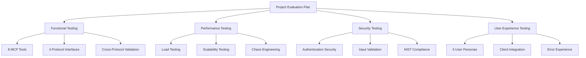

# Puppeteer-MCP Project Evaluation Plan

**Comprehensive evaluation framework to ensure production-ready browser automation through Model Context Protocol**

## 🎯 Overview

This documentation provides a complete evaluation framework for the **puppeteer-mcp** project, ensuring it delivers reliable browser automation capabilities through the Model Context Protocol (MCP) at enterprise scale.

### What Gets Evaluated

- **8 MCP Tools**: Complete browser automation toolkit
- **4 Protocol Interfaces**: MCP, REST, gRPC, WebSocket
- **Enterprise Features**: Authentication, session management, security
- **Performance & Scalability**: 1000+ concurrent sessions, 500+ actions/second
- **User Experience**: Intuitive APIs, error handling, client integration

### Why This Matters

- **Production Readiness**: Validate enterprise deployment readiness
- **User Confidence**: Ensure reliable, predictable behavior
- **Security Assurance**: Meet enterprise security requirements
- **Performance Guarantee**: Deliver consistent performance at scale
- **Quality Excellence**: Exceed user expectations across all interfaces

:::note[Beta Feedback Program]
This evaluation framework is designed to validate Puppeteer MCP for production readiness while gathering essential user feedback during the beta phase.
:::

## 📚 Documentation Structure

### 🚀 Getting Started

- **[Quick Start Guide](/evaluation/quick-start)** - Get evaluation running in 30 minutes
- **[Main Evaluation Plan](/evaluation/project-plan)** - Comprehensive 16-week strategy (this document)

### 🔧 Testing Strategies

- **[Functional Testing](/testing/acceptance-testing)** - MCP tools, protocols, integration validation
- **[Performance Testing](/testing/performance-testing)** - Load testing, scalability, chaos engineering
- **[Security Testing](/testing/security-testing)** - Authentication, compliance, vulnerability testing
- **[UX Testing](/testing/ux-testing)** - User journeys, client integration, error experience

### 📋 Test Scenarios

- **[UX Test Scenarios](/testing/ux-testing)** - Real user workflow implementations
- **[Error Experience Guide](/testing/ux-error-experience)** - Comprehensive error handling validation
- **[UX Testing Checklist](/testing/ux-checklist)** - Implementation roadmap and checklists

## 🏗️ Evaluation Architecture



## 📈 Success Metrics

### Functional Excellence

- ✅ **100% Test Coverage**: All MCP tools and protocols tested
- ✅ **Zero Critical Bugs**: No blocking functional issues
- ✅ **Cross-Protocol Parity**: Consistent behavior across interfaces
- ✅ **Error Handling**: Graceful failure recovery

### Performance Excellence

- 🚀 **Response Times**: <500ms session creation, <100ms actions (P95)
- 📈 **Scalability**: 1000+ concurrent sessions, 500+ actions/second
- 💪 **Reliability**: 99.9% uptime under load
- 🔄 **Recovery**: <5min mean time to recovery

### Security Excellence

- 🔒 **Zero Vulnerabilities**: No critical or high severity issues
- 🛡️ **Authentication**: 100% endpoint protection coverage
- 📋 **Compliance**: Complete NIST control implementation
- 🔍 **Monitoring**: Real-time security event detection

### User Experience Excellence

- 😊 **User Satisfaction**: >4.5/5 across all user personas
- ⚡ **Time to Success**: <30min for new users
- 🎯 **Task Completion**: >90% success rate
- 🆘 **Error Experience**: Clear, actionable error messages

## 🗓️ Implementation Timeline

| Phase                    | Duration    | Focus                    | Key Deliverables                           |
| ------------------------ | ----------- | ------------------------ | ------------------------------------------ |
| **Foundation**           | Weeks 1-2   | Infrastructure Setup     | Testing frameworks operational             |
| **Core Validation**      | Weeks 3-6   | Functional & Performance | All tools working, targets met             |
| **Security Hardening**   | Weeks 7-10  | Security & Compliance    | Zero vulnerabilities, compliance certified |
| **User Experience**      | Weeks 11-14 | UX & Integration         | >90% task completion, client integration   |
| **Production Readiness** | Weeks 15-16 | Final Validation         | Production deployment approved             |

## 🛠️ Quick Start Commands

### Initial Setup

```bash
# Install and configure evaluation framework
npm install
npm run evaluation:setup

# Run quick validation
npm run evaluation:quick-check
```

### Daily Operations

```bash
# Morning health check
npm run evaluation:health-check

# Run core test suites
npm run test:functional:core
npm run test:performance:baseline
npm run test:security:basic
npm run test:ux:core
```

### Weekly Reporting

```bash
# Generate comprehensive report
npm run evaluation:weekly-report

# Update stakeholder dashboard
npm run evaluation:dashboard:update
```

## 🎯 Evaluation Phases

### Phase 1: Foundation Setup

**Goal**: Establish robust testing infrastructure

**Key Activities**:
- Configure testing frameworks (Jest, K6, OWASP ZAP)
- Set up CI/CD pipelines with GitHub Actions
- Initialize monitoring dashboards (Grafana, Prometheus)
- Establish baseline metrics and success criteria

**Success Criteria**: All testing tools operational, pipelines functional

### Phase 2: Core Validation

**Goal**: Validate all functional and performance requirements

**Key Activities**:
- Execute comprehensive MCP tool testing
- Perform cross-protocol consistency validation
- Conduct load testing and performance benchmarking
- Validate browser automation workflows

**Success Criteria**: 100% functional coverage, performance targets met

### Phase 3: Security Hardening

**Goal**: Ensure enterprise-grade security

**Key Activities**:
- Penetration testing and vulnerability assessment
- Authentication and authorization validation
- NIST compliance verification
- Security monitoring implementation

**Success Criteria**: Zero critical vulnerabilities, compliance certified

### Phase 4: User Experience

**Goal**: Deliver exceptional user experience

**Key Activities**:
- User journey testing across all personas
- MCP client integration validation (Claude Desktop, VS Code)
- Error experience optimization
- API usability testing

**Success Criteria**: >90% task completion, >4.5/5 satisfaction

### Phase 5: Production Readiness

**Goal**: Final validation for production deployment

**Key Activities**:
- Comprehensive end-to-end testing
- Performance optimization and tuning
- Security certification and sign-off
- Operational readiness validation

**Success Criteria**: Production deployment approved

## 🔍 Key Testing Areas

### MCP Tools Validation

| Tool                     | Purpose                  | Test Focus                          |
| ------------------------ | ------------------------ | ----------------------------------- |
| `create-session`         | Session management       | Authentication, concurrency, limits |
| `list-sessions`          | Session enumeration      | Filtering, permissions, performance |
| `delete-session`         | Session cleanup          | Authorization, state consistency    |
| `create-browser-context` | Browser initialization   | Configuration, resource limits      |
| `list-browser-contexts`  | Context management       | Isolation, performance at scale     |
| `close-browser-context`  | Resource cleanup         | Memory management, state cleanup    |
| `execute-in-context`     | Browser automation       | All command types, error handling   |
| `execute-api`            | Cross-protocol execution | Protocol consistency, performance   |

### Protocol Interface Testing

- **MCP**: Native tool execution, resource access
- **REST**: HTTP API endpoints, status codes, error handling
- **gRPC**: Service methods, streaming, performance
- **WebSocket**: Real-time events, connection management

### User Experience Validation

- **5 User Personas**: Web scraping developer, QA engineer, business analyst, DevOps engineer, AI developer
- **Real Workflows**: End-to-end automation scenarios
- **Error Experience**: Clear messages, recovery guidance
- **Client Integration**: Claude Desktop, VS Code extensions

## 📊 Monitoring & Dashboards

### Real-Time Dashboards

- **Functional Status**: Test coverage, pass/fail rates
- **Performance Metrics**: Response times, throughput, resource usage
- **Security Status**: Vulnerability counts, compliance scores
- **User Experience**: Task completion rates, satisfaction scores

### Alerting & Notifications

- **Critical Issues**: Immediate escalation for blocking problems
- **Performance Degradation**: Automatic alerts for SLA violations
- **Security Events**: Real-time security threat notifications
- **Test Failures**: Immediate notification of test suite failures

## 🆘 Support & Troubleshooting

### Common Issues

| Issue              | Quick Fix                              | Escalation       |
| ------------------ | -------------------------------------- | ---------------- |
| Test Failures      | `npm run evaluation:retry`             | Technical lead   |
| Performance Issues | `npm run evaluation:profile`           | Performance team |
| Security Alerts    | `npm run security:emergency-scan`      | Security team    |
| Dashboard Down     | `npm run evaluation:dashboard:restart` | DevOps team      |

### Getting Help

- **Documentation**: Start with this guide and linked documentation
- **Logs**: `npm run evaluation:logs` for detailed debugging
- **Team Support**: Slack #puppeteer-mcp-evaluation
- **Emergency**: On-call rotation for critical issues

:::tip[Evaluation Best Practices]
- Run daily health checks to catch issues early
- Monitor key metrics continuously during evaluation phases
- Document all findings and improvements for future iterations
- Maintain clear communication channels between evaluation teams
:::

## 🎉 Success Stories

This comprehensive evaluation framework ensures that the **puppeteer-mcp** project will:

✅ **Deliver Reliable Browser Automation** through validated MCP tools  
✅ **Scale to Enterprise Requirements** with proven performance  
✅ **Meet Security Standards** with zero critical vulnerabilities  
✅ **Provide Exceptional UX** with >90% task completion rates  
✅ **Enable Seamless Integration** across all protocol interfaces

## Related Documentation

- [Quick Start Guide](/evaluation/quick-start) for immediate evaluation setup
- [Testing Framework](/testing/) for detailed testing methodologies
- [Security Testing](/testing/security-testing) for security validation
- [Performance Testing](/testing/performance-testing) for scalability validation
- [UX Testing](/testing/ux-testing) for user experience validation
- [Operations Guide](/operations/) for production deployment considerations

## Getting Started

**Ready to validate your project's excellence? Start with the [Quick Start Guide](/evaluation/quick-start)!**

:::note[AI-Powered Evaluation]
This evaluation framework was designed using advanced AI planning techniques to ensure comprehensive validation of the puppeteer-mcp project's functionality, performance, security, and user experience.
:::

## Conclusion

The Puppeteer MCP evaluation framework provides a systematic approach to validating production readiness across all critical dimensions. By following this comprehensive plan, teams can ensure their browser automation platform meets enterprise standards while delivering exceptional user experiences across all supported protocols and interfaces.