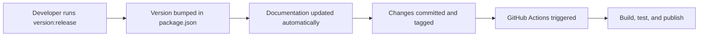

# Version Management Guide

The project uses automated version synchronization to ensure that all documentation files always reflect the current version from `package.json`. This prevents outdated version references in documentation and maintains consistency across the entire codebase.

:::note[Automated Version Control]
Version management is fully automated with pre-commit hooks, GitHub Actions, and comprehensive synchronization scripts to maintain consistency across all project documentation and package files.
:::

## Available Commands

### Check Version Consistency

```bash
npm run version:check
```

Checks if all documentation files have the correct version number. Exits with error code 1 if any files are outdated.

### Synchronize Versions

```bash
npm run version:sync
```

Updates all documentation files to match the current version in `package.json`.

### Bump Version

```bash
npm run version:bump [major|minor|patch]
```

Bumps the version in `package.json` and automatically updates all documentation files.

### Full Release Process

```bash
npm run version:release [major|minor|patch]
```

Runs the complete release process:

1. Ensures clean git state and main branch
2. Pulls latest changes
3. Runs all tests
4. Bumps version
5. Updates documentation
6. Commits and tags
7. Pushes to remote

### Dry Run

```bash
npm run update:version:dry
```

Shows which files would be updated without making any changes.

## Automation

### Pre-commit Hook

When committing changes to `package.json` that include a version change, the pre-commit hook automatically:

1. Detects the version change
2. Updates all documentation files
3. Stages the updated files for commit

### GitHub Actions

#### Version Sync Workflow

- **Trigger**: Push to main branch with `package.json` changes
- **Action**: Checks version consistency and creates a commit if updates are needed

#### Version Bump Workflow

- **Trigger**: Manual workflow dispatch
- **Action**: Creates a PR with version bump and documentation updates

#### Release Workflow

- **Trigger**: Git tags matching `v*.*.*`
- **Action**: Full release process including NPM publish and Docker image creation

## How Version Updates Work

The version update script (`scripts/update-version.mjs`) searches for version patterns in:

- All `.md` files in the project root
- All documentation in `starlight-docs/src/content/docs/`
- Testing documentation in `testing/`
- Other markdown files throughout the project

### Updated Patterns

The script updates patterns like:

```bash
v1.1.0
version: 1.1.0
puppeteer-mcp v1.1.0
```

Including NPM package version references throughout documentation files.

## Best Practices

:::tip[Version Management Best Practices]
1. **Always use npm scripts** for version management instead of manually editing version numbers
2. **Run version:check** in CI to ensure consistency
3. **Use version:bump** for development releases
4. **Use version:release** for production releases
5. **Review the dry-run output** before applying changes
:::

## Troubleshooting

### Version Check Fails

If `npm run version:check` fails:

```bash
npm run version:sync
git add -A
git commit -m "chore: sync documentation versions"
```

### Pre-commit Hook Issues

If the pre-commit hook fails:

1. Check if tests are passing: `npm test`
2. Check TypeScript: `npm run typecheck`
3. Manually sync versions: `npm run version:sync`

### Manual Version Update

If you need to manually set a specific version:

```bash
npm version 1.0.14 --no-git-tag-version
npm run version:sync
git add -A
git commit -m "chore: set version to 1.0.14"
```

## Configuration

Version patterns are defined in `scripts/update-version.mjs`. To add new patterns or exclude files, modify the script configuration.

## Integration with Release Process

The version management system is fully integrated with the release process:



### Complete Flow

1. Developer runs `npm run version:release minor`
2. Version is bumped in `package.json`
3. All documentation is automatically updated
4. Changes are committed and tagged
5. GitHub Actions takes over for building, testing, and publishing

This ensures that every release has consistent version numbers across all documentation and package files.

## Command Reference

| Command | Description | Use Case |
|---------|-------------|----------|
| `npm run version:check` | Verify version consistency | CI validation |
| `npm run version:sync` | Update all documentation | Fix inconsistencies |
| `npm run version:bump [type]` | Bump version and update docs | Development releases |
| `npm run version:release [type]` | Full release process | Production releases |
| `npm run update:version:dry` | Preview changes | Review before applying |

## Version Types

| Type | Description | Example |
|------|-------------|---------|
| `patch` | Bug fixes and small changes | `1.0.13` → `1.0.14` |
| `minor` | New features, backward compatible | `1.0.13` → `1.1.0` |
| `major` | Breaking changes | `1.0.13` → `2.0.0` |

## Related Documentation

- [CI/CD Pipeline](/operations/ci-cd) for release automation
- [Development Workflow](/development/workflow) for development processes
- [NPM Package Deployment](/deployment/npm-package) for publishing

## Conclusion

The automated version management system ensures consistency across all project documentation and package files. By integrating with the CI/CD pipeline and providing comprehensive automation, it eliminates manual version maintenance tasks while ensuring accuracy and reliability throughout the release process.